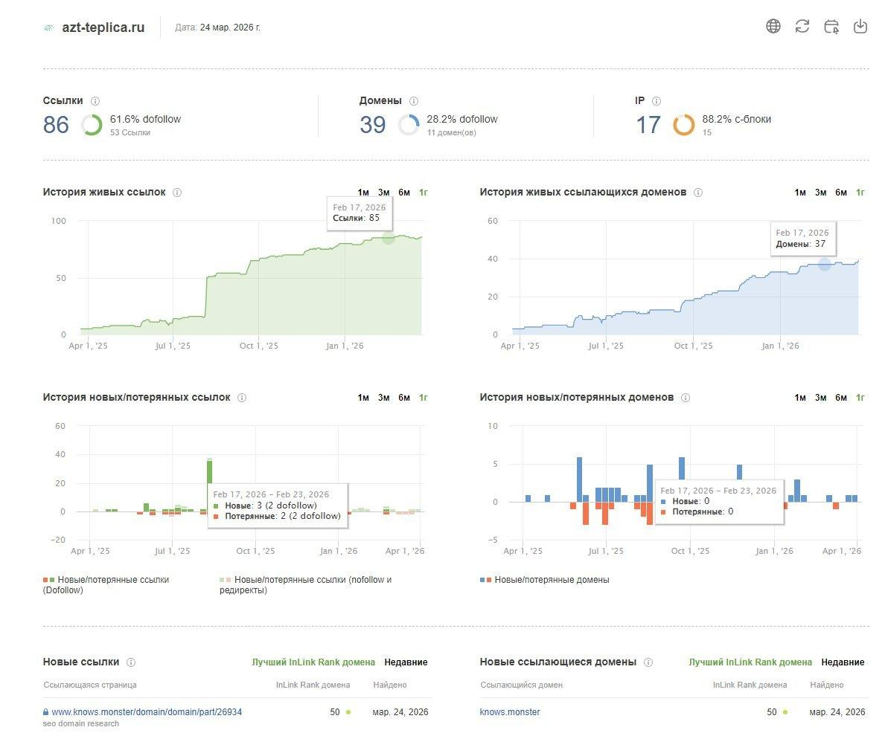
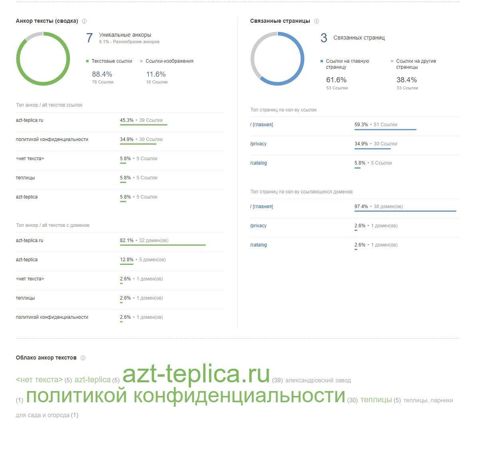
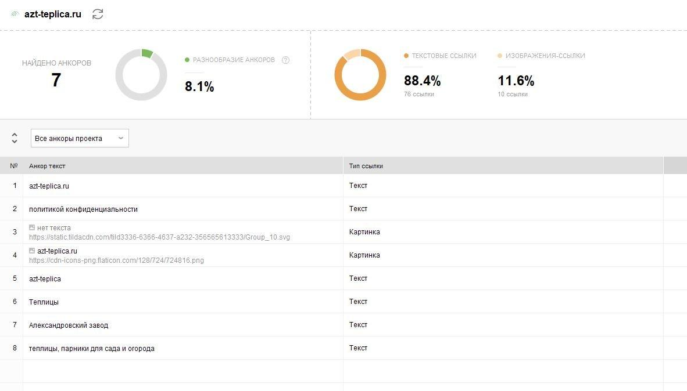
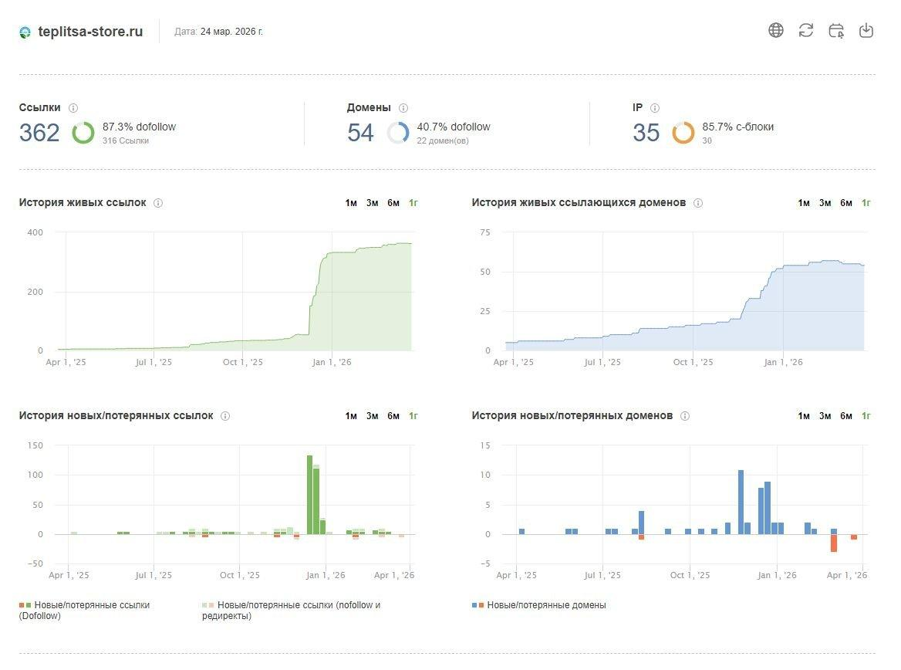
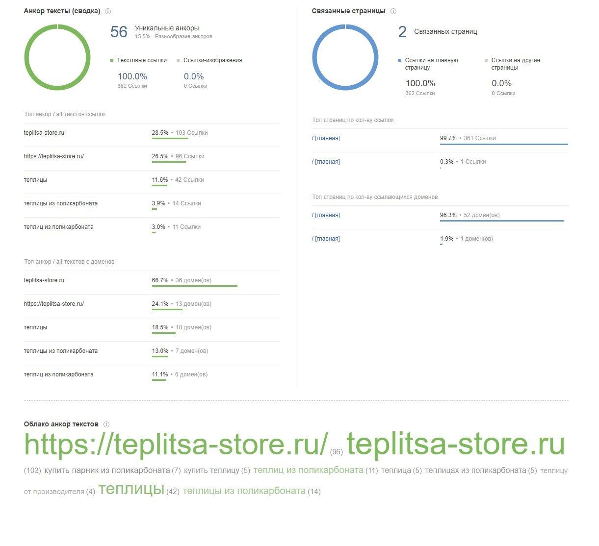
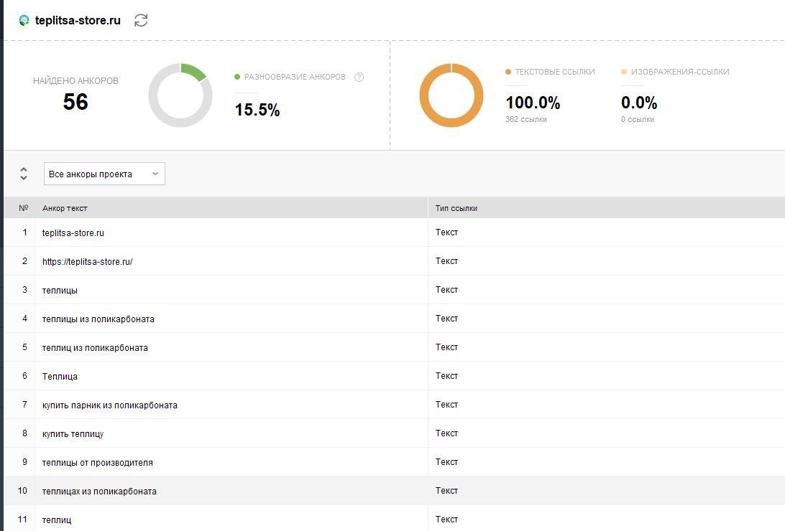
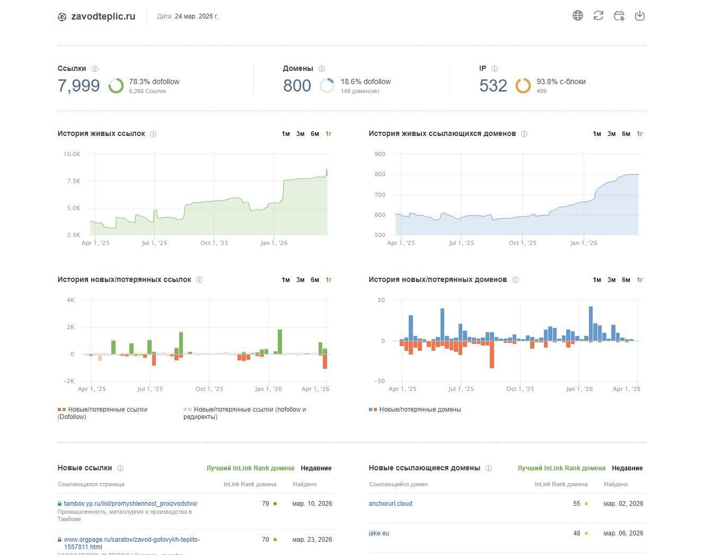
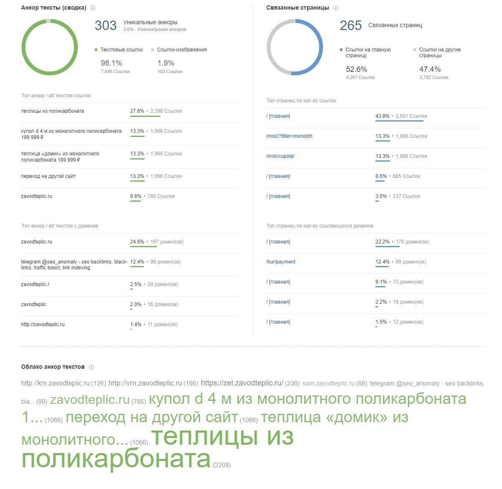
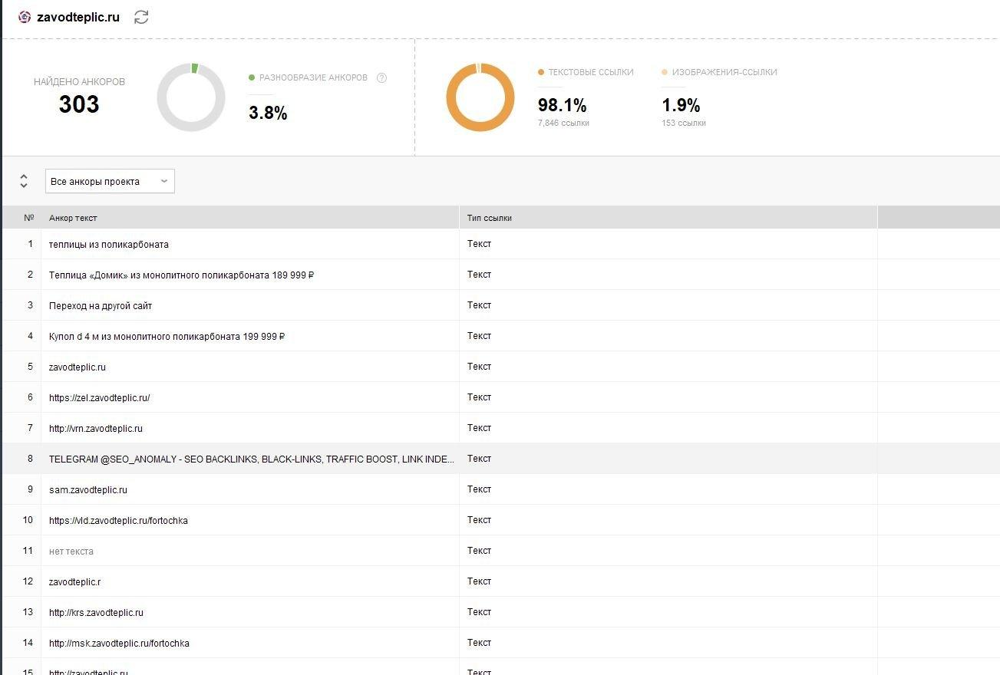

**Сравнительный анализ**

**ссылочного профиля**

**Цель отчета**

Сравнить текущий ссылочный профиль сайта azt-teplica.ru с конкурентами —
teplitsa-store.ru и zavodteplic.ru — и определить, насколько сайт
отстаёт по масштабу, структуре и качеству ссылочной массы, а также какие
конкретные шаги нужно предпринять, чтобы сократить разрыв.

**Сравнение ключевых метрик**

| **Показатель**             | **azt-teplica.ru** | **teplitsa-store.ru** | **zavodteplic.ru** |
|----------------------------|--------------------|-----------------------|--------------------|
| **Ссылки (всего)**         | 86                 | 362                   | 7 999              |
| **Домены-доноры**          | 39                 | 54                    | 800                |
| **IP-адреса**              | 17                 | 35                    | 532                |
| **Dofollow ссылок**        | 61.6%              | 87.3%                 | 78.3%              |
| **Dofollow доменов**       | 28.2%              | 40.7%                 | 18.6%              |
| **Уникальные анкоры**      | 7                  | 56                    | 303                |
| **Разнообразие анкоров**   | 8.1%               | 15.5%                 | 3.8%               |
| **Текст / Картинки**       | 88.4% / 11.6%      | 100% / 0%             | 98.1% / 1.9%       |
| **Доля ссылок на главную** | 61.6%              | 100.0%                | 52.6%              |
| **Связанных страниц**      | 3                  | 2                     | 265                |

- azt-teplica.ru критически уступает конкурентам по масштабу — разрыв
  > измеряется в разах, а не в процентах.

- teplitsa-store.ru — ближайший конкурент, но его профиль структурно
  > однобок: 100% ссылок только на главную.

- zavodteplic.ru — тяжёлый игрок с признаками black-link активности;
  > копировать его модель не рекомендуется.

**Сравнение качества профиля**

| **Сайт**              | **Сильные стороны**                                                                                                                                     | **Слабые стороны**                                                                                                                                                                |
|-----------------------|---------------------------------------------------------------------------------------------------------------------------------------------------------|-----------------------------------------------------------------------------------------------------------------------------------------------------------------------------------|
| **azt-teplica.ru**    | Чистый профиль без black-link активности; плавный органический рост; есть несколько тематических анкоров (теплицы, Александровский завод).              | Критически мало доменов и анкоров; 1/3 ссылок — технический мусор Tilda на /privacy; почти нет веса на внутренних страницах; только 28.2% доменов дают dofollow.                  |
| **teplitsa-store.ru** | Богатая анкорная картина с коммерческими формулировками (теплицы из поликарбоната, купить теплицу, теплицы от производителя); высокий dofollow (87.3%). | 100% ссылок только на главную страницу; резкий скачок роста в январе 2026 — признак разовой закупки; нулевая доля image-ссылок — неестественная однородность.                     |
| **zavodteplic.ru**    | Самый крупный профиль; хорошее распределение по внутренним страницам (47.4%); 265 связанных страниц; сильные анкоры по коммерческим запросам.           | Прямые black-link сигналы (TELEGRAM @SEO_ANOMALY в анкорах); 99 доменов ведут на /kur/payment — подозрительная концентрация; низкое разнообразие анкоров 3.8% при 303 уникальных. |

**Профиль сайта azt-teplica.ru**

| Краткий вывод: У сайта очень слабый и структурно проблемный ссылочный профиль. Главная угроза — не отсутствие ссылок само по себе, а то, что треть всей ссылочной массы уходит на страницу /privacy через шаблонные Tilda-ссылки. Коммерческие разделы практически не получают ссылочного веса. |
|-------------------------------------------------------------------------------------------------------------------------------------------------------------------------------------------------------------------------------------------------------------------------------------------------|

**Основные наблюдения**

- Профиль маленький: 86 ссылок, 39 доменов, 17 IP.

- Всего 7 уникальных анкоров при разнообразии 8.1% — профиль крайне
  > узкий, почти полностью брендовый.

- 34.9% ссылок (30 штук) с анкором «политикой конфиденциальности» ведут
  > на /privacy — типичный след шаблонного Tilda-блока в футере, не
  > SEO-доноры.

- 61.6% ссылок на главную — /catalog получает лишь 5 ссылок (5.8%) и
  > всего 1 уникальный донор.

- Только 28.2% доменов дают dofollow-ссылки (11 из 39) — необычно низкий
  > показатель.

- 88.2% IP приходятся на С-блоки (15 из 17) — высокая концентрация,
  > характерная для кластерного хостинга.

**Профиль конкурента teplitsa-store.ru**

**Основные наблюдения**

- Профиль значительно больше: 362 ссылки, 54 домена, 35 IP — против
  > 86/39/17 у azt-teplica.ru.

- 87.3% dofollow — очень высокий показатель, характерный для активной
  > закупки ссылок.

- 56 уникальных анкоров при разнообразии 15.5% — есть коммерческие
  > формулировки: «теплицы из поликарбоната», «купить теплицу», «теплицы
  > от производителя».

- 99.7% ссылок (361 из 362) ведут на главную страницу — при наличии 56
  > разных анкоров это указывает на механическую закупку без
  > архитектурной логики.

- Резкий скачок с ~20 до ~360 ссылок произошёл в декабре 2025 — январе
  > 2026 — признак разовой закупки, а не планомерного роста.

- 100% ссылок — текстовые, ноль image-ссылок — нетипичная картина,
  > усиливает подозрение на покупной профиль.

*Из 56 анкоров минимум 8 — реально коммерческие тематические
формулировки. Брендовые анкоры занимают ~55% от всех ссылок — типичный
покупной профиль с частичной тематизацией.*

**Профиль конкурента zavodteplic.ru**

**Основные наблюдения**

- Разрыв с azt-teplica.ru по числу доменов превышает 20 раз: 800 против
  > 39.

- 47.4% ссылок ведут не на главную, а на внутренние страницы — 265
  > связанных страниц. С архитектурной точки зрения это сильная модель.

- 78.3% dofollow-ссылок — высокий показатель, характерный для активной
  > закупки.

- 303 уникальных анкора при всего 3.8% разнообразия — парадокс
  > объясняется массовым дублированием анкоров с одним и тем же текстом.

- В таблице анкоров — прямые сигналы black-link активности: «TELEGRAM
  > @SEO_ANOMALY - seo backlinks, black-links» как анкор у 99 доменов.

- 99 доменов ведут на /kur/payment — концентрация в нетипичном разделе
  > указывает на спамные ссылки.

*В таблице анкоров видны прямые сигналы black-link активности: «TELEGRAM
@SEO_ANOMALY - SEO BACKLINKS, BLACK-LINKS, TRAFFIC BOOST, LINK INDE...»
— это означает использование сеток для накрутки. Копировать данную
модель крайне рискованно.*

**Вывод**

**По сравнению с teplitsa-store.ru**

- azt-teplica.ru уступает по объёму, но teplitsa-store.ru не
  > распределяет ссылочный вес по внутренним страницам — это его главная
  > уязвимость.

- Если наращивать 20–30 качественных доноров на /catalog и
  > гео-посадочные страницы, azt-teplica.ru может опередить конкурента
  > по архитектурной силе профиля без копирования закупочных практик.

- teplitsa-store.ru — тот конкурент, которого реально обгонять за счёт
  > качества и правильного распределения, а не за счёт количества.

**По сравнению с zavodteplic.ru**

- На короткой дистанции конкурировать с zavodteplic.ru только ссылками
  > нецелесообразно — разрыв слишком большой.

- Заимствовать стоит только архитектурную логику: распределение ссылок
  > по внутренним URL, брендовым разделам и каталогу.

- Копировать black-link стратегию (Telegram-сетки, /kur/payment)
  > категорически не рекомендуется: это повышает риск санкций и
  > нестабильности профиля.

**Как растить анкоры: план действий**

Текущий профиль ezt-teplica.ru содержит только 7 уникальных анкоров при
разнообразии 8.1%. Ниже — приоритетные анкоры для наращивания с
указанием целевых страниц.

| **Анкор**                                | **Тип**          | **Целевая страница**                    | **Приоритет**  |
|------------------------------------------|------------------|-----------------------------------------|----------------|
| теплицы из поликарбоната                 | Коммерческий     | /catalog или /tepliczy-iz-polikarbonata | **Высокий**    |
| купить теплицу                           | Коммерческий     | /catalog или категория                  | **Высокий**    |
| теплицы от производителя                 | Коммерческий     | /catalog                                | **Высокий**    |
| теплицы Пермь / купить теплицу Пермь     | Гео-коммерческий | Посадочная страница /perm или аналог    | **Высокий**    |
| парники для дачи                         | Информационный   | /blog или статейный раздел              | Средний        |
| теплица из поликарбоната купить недорого | Коммерческий     | /catalog с фильтром цены                | Средний        |
| azt-teplica.ru (бренд)                   | Брендовый        | Главная страница                        | Поддерживающий |
