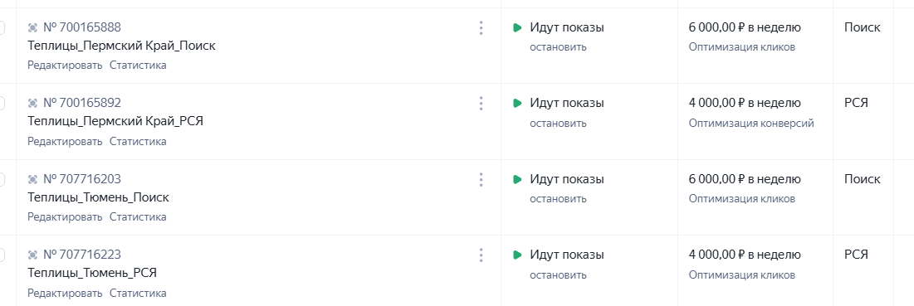
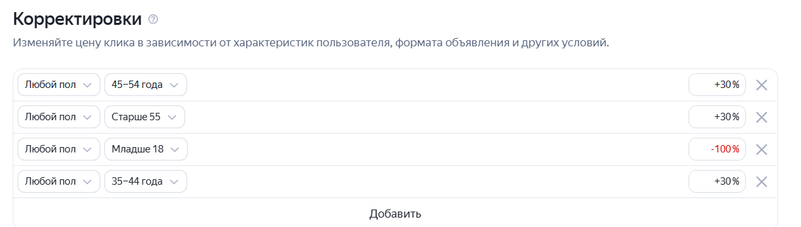
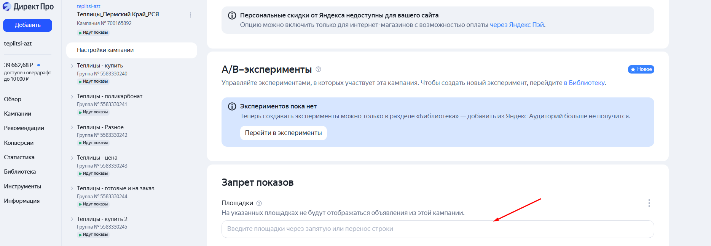
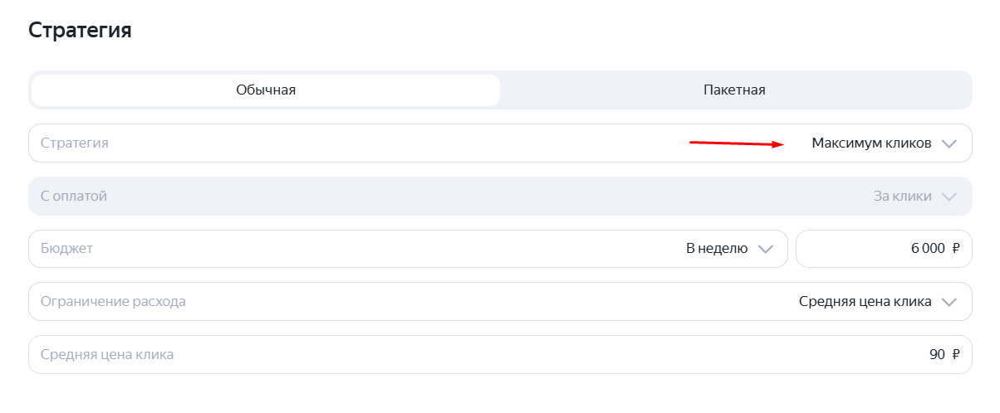
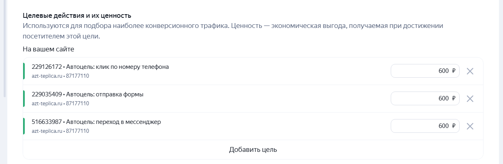

**<u>Аудит по Яндекс Директ</u>**

**Анализ ошибок с точки зрения структуры**

- Понятны названия рекламных кампаний - Да

- Удобно фильтровать кампании по названиям (по гео, по типу, по
  > лендингам, по темам, по теплоте) - Да

- Разделены рекламные кампании по типам (поиск, РСЯ, ремаркетинг) - Да

!!! В рекламный кабинет можно внедрить кампании с оплатой за конверсии.
В частности, это могут быть мастер-кампании с таргетингом на общую
семантику, на аудиторию сайтов конкурентов, а также на семантические
запросы конкурентов.

Такие кампании позволяют оптимизировать расходы, фокусируясь на конечных
результатах — фактических конверсиях. Они позволяют более точно
нацеливаться на аудиторию, которая уже интересуется теми же или схожими
предложениями, повышая эффективность продвижения.

**Анализ ошибок с точки зрения аналитики**

- Установлена Метрика на сайте **-** Да

- Корректно определяются конверсии **-** ?

- Связана Метрика с Директом **-** Да

- Добавлены UTM-метки ко всем ссылкам в объявлениях **-** Да

## **Анализ ошибок с точки зрения времени**

1)  Задан временной таргетинг для ваших кампаний - Нет

>  src="_img/image1.png"
> style="width:6.29569in;height:0.94444in" />
>
> !!! Рекомендация: провести анализ временных интервалов с максимальной
> конверсионной активностью. На основе данных сформировать расписание
> показов, исключив неэффективные временные промежутки. Это позволит
> повысить рентабельность, сфокусировав показы на ключевых часах.

2)  Используются корректировки ставок по времени - Нет

3)  Корректно установлен часовой пояс - Да

4)  Введено корректное время работы в Визитке - Нет

> !!! В ходе аудита выявлено несоответствие: время работы, указанное в
> объявлениях, отличается от времени, указанного на сайте. Рекомендация:
> синхронизировать данные, чтобы обеспечить точную и согласованную
> информацию для пользователей.
>
>  src="_img/image2.png"
> style="width:2.72917in;height:0.90775in" /> src="_img/image13.png"
> style="width:5.61458in;height:1.27083in" />

## 

## **Анализ ошибок с точки зрения географии**

- Правильно выставлен регион показа **-** Да

## **Анализ ошибок с точки зрения корректировок**

- Включены корректировки ставок по полу и возрасту вашей целевой
  > аудитории - Да

## **Анализ ошибок с точки зрения семантики**

- Удалены явные и неявные дубли ключевых слов - Да

- Запросы сгруппированы по теплоте и темам - Да, есть группировка по
  > темам и теплоте

## **Анализ ошибок с точки зрения минус-слов**

- Добавлены минус-слова в поисковые кампании - Есть, но можно добавить

>  src="_img/image9.png"
> style="width:6.29569in;height:4.02778in" />

!!! Необходимо регулярно анализировать отчёт «Поисковые запросы» и на
его основе добавлять новые минус-слова. Как видно из истории изменений
поисковых кампаний, этот процесс не проводится. Рекомендую внедрить
систематический подход к корректировке минус-слов для повышения
эффективности.

!!! Также необходимо анализировать тот же отчет «Поисковые запросы» с
целью расширения семантики. Это позволит выявить новые перспективные
запросы, которые потенциально расширят охват и увеличат количество
целевых пользователей. В итоге это даст дополнительный поток
релевантного трафика и повысит эффективность кампаний.

- Сделана кросс минусация - Да

- Добавлены расширенный список запрещенных площадок - Нет

> !!! В ходе анализа рекламного кабинета в компании не выявлено
> использование запрещенных площадок. При этом рекомендуется регулярно
> анализировать списки площадок и при обнаружении некачественных
> добавлять их в список для запрета показа.
>
> Регулярный анализ и внесение некачественных площадок в запрет позволит
> снизить риски показа рекламы на неподходящих ресурсах, улучшить
> качество трафика и повысить эффективность рекламных кампаний.

## **Анализ ошибок с точки зрения объявления**

1.  Все объявления прошли модерацию - Да

2.  Ссылки в объявлениях ведут на нужные страницы - Да

3.  Создано несколько объявлений на тест - Да, но они одинаковые

>  src="_img/image7.png"
> style="width:6.29569in;height:3.18056in" />
>
> !!! В ходе анализа выявлено, что в группе объявлений все четыре
> объявления идентичны. Рекомендуется создавать 3-4 объявления на группу
> с разными заголовками для тестирования, чтобы оптимизировать
> результаты и повысить эффективность рекламы

4.  Везде прописаны вторые заголовки, и они входят по длине - Да

>  src="_img/image8.png"
> style="width:6.29569in;height:2.20833in" />
>
> 12\. Объявления достаточно конкретны, в них нет общих фраз - Да, есть
> конкретика
>
> 13\. Из текстов объявлений четко понятно, что вы предлагаете - Да
>
> 14\. Объявления говорят о выгоде потребителя - Да
>
> 15\. Добавлен призыв к действию в объявление - Да
>
> 16\. Добавлены быстрые ссылки - Да, 8
>
>  src="_img/image4.png"
> style="width:6.29569in;height:4in" />
>
> 17\. Есть ли Уточнения - Да
>
> 18\. UTM-метки в объявлениях и в быстрых ссылках — корректны - Нет

## 

## **Анализ ошибок РСЯ**

1.  Во всех РСЯ-кампаниях отключены показы на поиске - Да

2.  Отключен расширенный географический таргетинг для кампаний в РСЯ -
    > Да

3.  Создана ретаргетинговая кампания - Нет

> !!! В данный момент в каждой группе в РСЯ кампании по 8 объявлений,
> что является слишком большим количеством. Рекомендуется доработать и
> оставить по 3-4 объявления с различными заголовками и изображениями
> для тестирования.
>
>  src="_img/image10.png"
> style="width:6.29569in;height:1.13889in" />

## **Анализ ошибок с точки зрения настроек**

**!!!** В данный момент в поисковой кампании установлена стратегия
«максимум кликов». В ходе аудита рекомендуется изменить стратегию на
«максимум конверсий», чтобы оптимизировать рекламу под реальные целевые
действия и повысить эффективность кампании**.**

!!! В ходе аудита выявлено, что в данный момент для оптимизации кампании
используются только автоцели, что не позволяет полноценно обучаться на
конкретных действиях. Рекомендуется настроить цели так, чтобы были чётко
определённые конверсии, под которые система будет обучаться и
оптимизироваться, повышая эффективность.

## **Рекомендации:**

1.  Внедрить кампании с оплатой за конверсии.

2.  Провести анализ временных интервалов и оптимизировать расписание.

3.  Синхронизировать время работы в объявлениях с временем на сайте.

4.  Регулярно анализировать отчет «Поисковые запросы» и добавлять
    > минус-слова.

5.  Анализировать «Поисковые запросы» для расширения семантики.

6.  В каждой группе объявлений создавать 3-4 объявления с разными
    > заголовками.

7.  Изменить стратегию с «максимум кликов» на «максимум конверсий».

8.  Настроить цели для оптимизации под конкретные конверсии.

Внедрение этих рекомендаций позволит повысить эффективность рекламных
кампаний, улучшить качество трафика, точнее настраивать показы по
времени и целям, снизить риски некачественного трафика и, в итоге,
повысить рентабельность и окупаемость рекламных вложений.
